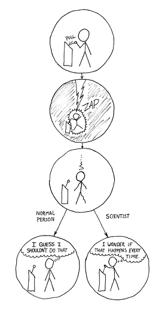
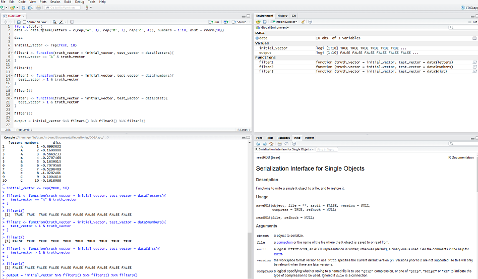
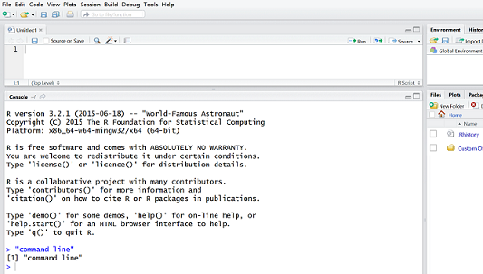
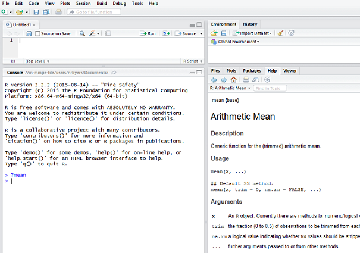
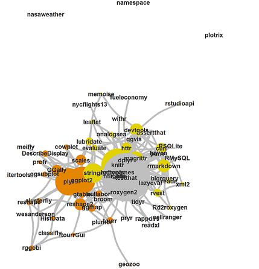
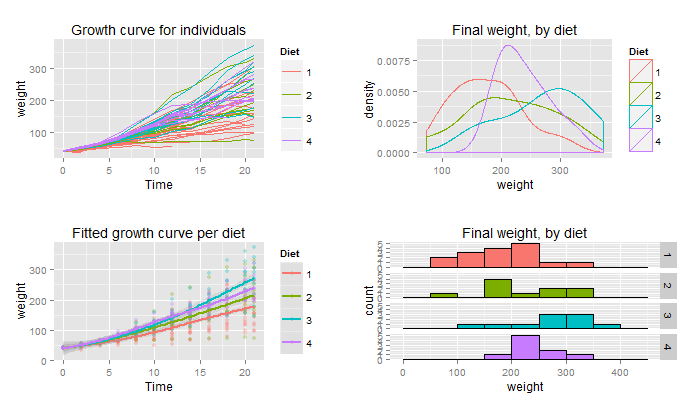
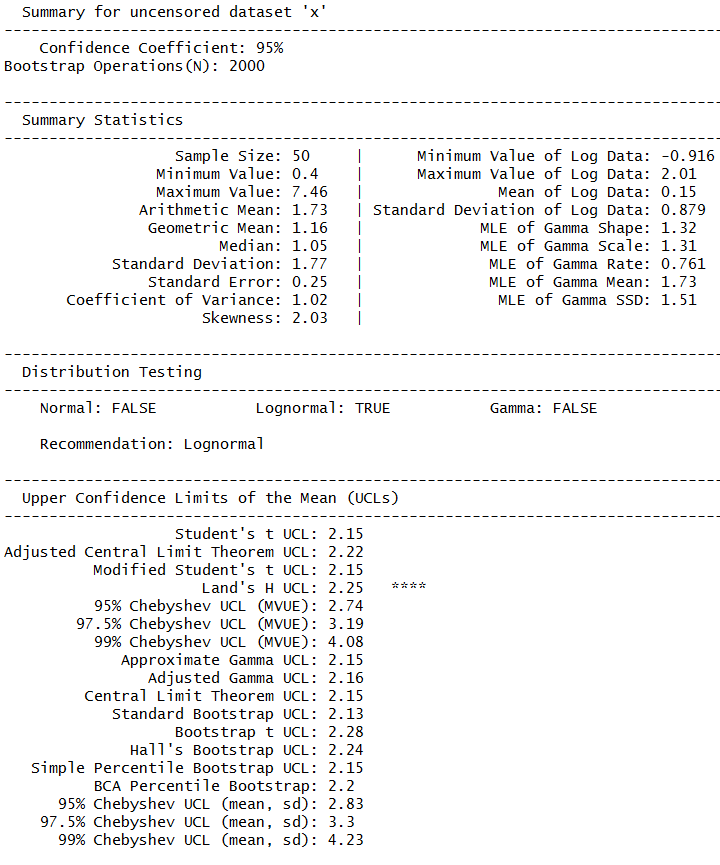
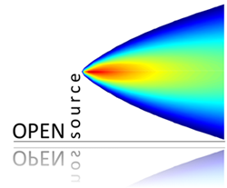

## Who we are

- Nathan Byers
    + Database Analyst at Indiana University (IU) School of Medicine
- Kali Frost
    + Research Associate at IU School of Public Health
- Eric Bailey (_in absentia_)
    + Web Application Developer at IU School of Medicine
- Former employees at the Indiana Department of Environmental Management
- Experienced data analysts and R programmers


## Who we are

- R enthusiasts
- Follow along at https://ebailey78.shinyapps.io/epaToxicsPresentation


## What this is 
<figure style = "float: right;">
  
  
</figure>
- R presentation using [ioslides](http://rmarkdown.rstudio.com/ioslides_presentation_format.html)

- Source code is on [GitHub](https://github.com/NateByers/epaToxicsTraining) 

- This is entirely reproducible

- Comic credit: https://xkcd.com/242/

## Training Outline

* What is R and RStudio
* R basics
* The Hadleyverse
    + `dplyr`
    + `tidyr`
    + `ggplot2`
* Useful packages for air toxics
    + `raqdm`
    + `rucl`
    + `openair`
* Air toxics analysis demo
* Interactive web app with `shiny`

<div class="notes">
Presentation should last 50 to 60 minutes.

</div>

# What is R and RStudio

##  The R Project   

- R is free and open-source software for statistical computing and graphics
- [Download here](https://www.r-project.org/)
- It’s been very popular in academia for more than a decade
- Statisitcal software that can do complex analyses using built-in functions, similar to SAS
- Also a programming language that is extendable (i.e. you can write your own functions/software)

##  Popularity

- Originally written by statisticians for statisticians
- Now widely used in academia (not just stats departments)
- Making headway into government and industry, especially the biotech and finance sectors. 
- Here is a [link](http://r4stats.com/articles/popularity/) describing the increasing popularity of R.

## 

- After you download R, you may want to use an integrated development environment (IDE) like
RStudio 
- An IDE makes R a little more user friendly
- RStudio is free and can be downloaded at [rstudio.com](https://www.rstudio.com/)

## 



## Training Outline

* <font color="#D9D9D9">What is R and RStudio</font>
* R basics
* <font color="#D9D9D9">The Hadleyverse</font>
    + <font color="#D9D9D9">dplyr</font>
    + <font color="#D9D9D9">tidyr</font>
    + <font color="#D9D9D9">ggplot2</font>
* <font color="#D9D9D9">Useful packages for air toxics</font>
    + <font color="#D9D9D9">raqdm</font>
    + <font color="#D9D9D9">rucl</font>
    + <font color="#D9D9D9">openair</font>
* <font color="#D9D9D9">Air toxics analysis demo</font>
* <font color="#D9D9D9">Interactive web app with shiny</font>

## R Basics - Command line

- R is a language and an environment

- You type in the "command line" and hit enter to do something, in contrast to
pointing and clicking to do something



## R Basics - Command line 

- In this presentation, command line code will be shown in blocks with gray 
background shading

- The output will be shown in a separate block below the command line input
with a lighter shadow and `##` at the beginning of each line

```{r}
"command line"
1 + 1
```

## R Basics - Math

As we demonstrated in the previous slide, you can use R as a simple calculator

```{r}
3 - 1
2 * 2
10 / 5
log(10)
```

## R Basics - Variables

We can store numbers and text in variables

```{r}
x <- 1
x
x <- 10
x
y <- 2
x * y
```

## R Basics - Variables

```{r}
pollutant <- "benzene"
pollutant
pollutant <- "toluene"
pollutant
```

## R Basics - Vectors

- A series of numbers or text values and be stored together in a vector
- The container for a vector is `c( )`

```{r}
c(1, 2, 3)
x <- c(5, 6, 7)
x
z <- c("mercury", "cadmium")
z
```

## R Basics - Functions

- Variables and vectors contain data
- Functions do stuff to data
- You recongnize a function by parentheses `( )`

```{r}
x <- c(1, 2, 3, 3, 4, 5, 5, 6, 7, 7, 7)
mean(x)
median(x)
```

## R Basics - Functions

- To find out how to use a function, type `?` then the function name
- Below is an image of what you see in RStudio if you type `?mean` and hit return




## R Basics - Data Frames

- A data frame is a collection of vectors with the same length
- Basically a spreadsheet

```{r}
pollutant <- c("benzene", "acrolein")
value <- c(.7, .8)
unit <- c("ug/m^3", "ug/m^3")
df <- cbind(pollutant, value, unit)
df
```

## R Basics - Data Objects and Functions

- Those are the basic type of objects you'll need to be familiar with to understand this training/demonstration
- Vectors and data frames store numbers and text (a variable with a single value
is actually just a vector of length 1)
- Functions do things to vectors and data frames then return an output

## R Basics - Installing/loading packages

- R comes with functions immediately available
- Some functions come with R, but they are only available after loading a package using `library()`

```{r, eval = FALSE}
library(lattice)
```

- Some packages do not come with an R download
- Packages that are on [CRAN](https://cran.r-project.org/) can be downloaded and installed using `install.packages()`

```{r, eval=FALSE}
install.packages("devtools")
```

## R Basics - Installing from GitHub 

- You may want to use a package that isn't on CRAN 
- Many R developers put their packages on GitHub 


## R Basics - Installing from GitHub 

- To install a package from GitHub, load the `devtools` package

```{r, eval=FALSE}
library(devtools)
```

- Then use the `install_github()` function by specifying the user name and the repository

```{r, eval=FALSE}
install_github("ramnathv/rCharts")
```

## R Basics - Resources

- Many great resources for learning R
- Beginners material
    + [Quick R](http://www.statmethods.net/)
    + [UCLA](http://www.ats.ucla.edu/stat/r/)
    + [DataCamp](https://www.datacamp.com/courses/free-introduction-to-r)
    + [Code School](http://tryr.codeschool.com/)
- Intermediate/advanced material
    + [Cookbook for R](http://www.cookbook-r.com/)
    + [Coursera](https://www.coursera.org/course/rprog)
    + [Advanced R](http://adv-r.had.co.nz/)

## Training Outline

* <font color="#D9D9D9">What is R and RStudio</font>
* <font color="#D9D9D9">R basics</font>
* The Hadleyverse
    + `dplyr`
    + `tidyr`
    + `ggplot2`
* <font color="#D9D9D9">Useful packages for air toxics</font>
    + <font color="#D9D9D9">raqdm</font>
    + <font color="#D9D9D9">rucl</font>
    + <font color="#D9D9D9">openair</font>
* <font color="#D9D9D9">Air toxics analysis demo</font>
* <font color="#D9D9D9">Interactive web app with shiny</font>


## The Hadleyverse
<figure style = "float: right;">
  
  
</figure>

- The Hadleyverse is a collection <br>
of packages written by [Hadley Wickham](http://had.co.nz/)
- These packages make R much easier to use
- We will introduce three useful packages for <br> data manipulation (`dplyr`),
reshaping data <br> (`tidyr`), and data visualization (`ggplot2`)

- [Image credit](http://adolfoalvarez.cl/the-hitchhikers-guide-to-the-hadleyverse/)


# Data manipulation with `dplyr`

## `dplyr` - Overview

- A very handy data manipulation package
- Very fast (much of it is written in C++)
- Can work with tables from databases
- Main functions are `filter()`, `summarize()`, and `mutate()`
- These main functions take a data frame as input and return 
a data frame as output

## `dplyr` - Data

Below is a _made up_ data frame that will be used to easily visualize
`dplyr` operations

```{r}
tox <- read.table(header=T, text='
  monitor  parameter       day   hour  value  screen              
        A    benzene  20140601  08:00   0.72     1.3
        A    benzene  20140601  09:00   0.84     1.3
        A    benzene  20140602  08:00   1.35     1.3  
        A    benzene  20140602  09:00   0.94     1.3
        B    benzene  20140601  08:00   0.61     1.3
        B    benzene  20140601  09:00   0.70     1.3
        B    benzene  20140602  08:00   0.99     1.3
        B    benzene  20140602  09:00   1.70     1.3
        A    toluene  20140601  08:00   6.10     300
        A    toluene  20140601  09:00   2.51     300
                       ')
```


## `dplyr` - Filtering

- The first argument of `filter()` is a data frame, `filter(tox, ...)`
- The data frame can then be filters using logical expressions
- Here we filter the `tox` data frame so that we just get values from monitor A

```{r, message=FALSE, warning=FALSE}
library(dplyr)
filter(tox, monitor == "A")
```

## `dplyr` - Filtering

- You can enter more than one logical expression separated by a comma

```{r}
filter(tox, monitor == "B", value > screen)
```

- This is equivalent to using the `&` operator

```{r}
filter(tox, monitor == "B" & value > screen)
```


## `dplyr` - Summarize

- The first argument of `summarize()` is also a data frame
- However, the input data frame requires grouping information
- For example, if we wanted to summarize the `tox` data frame by 
returning daily averages for each pollutant, we need to group the 
data frame by `monitor`, `parameter`, and `day`

```{r}
head(tox)
```

## `dplyr` - Summarize

- We add grouping information by using the `group_by()` function

```{r}
tox_daily <- group_by(tox, monitor, parameter, day)
```

- Now we feed this data frame to the summary function, `summarize(tox_daily, ...)`
- To get daily averages, we also supply a function that will return the mean, and 
we name it `daily_mean` (obviously not a true daily mean, with only a few hours...)

```{r, eval=FALSE}
summarize(tox_daily, daily_mean = mean(value))
```

## `dplyr` - Summarize


```{r, echo=FALSE}
summarize(tox_daily, daily_mean = mean(value))
```


## `dplyr` - Add Columns

- You can add new columns to a data frame by using the `mutate()` function
- The output will have the same number of rows
- The first argument is the input data frame and the subsequent arguments
must be functions that return a single value for each row (i.e. *not* a 
summary function)

```{r, eval=FALSE}
mutate(tox, above_screen = value > screen)
```

## `dplyr` - Add Columns

```{r}
mutate(tox, above_screen = value > screen)
```

## `dplyr` - Add Columns

Here we add more than one column at a time

```{r}
mutate(tox, above_screen = value > screen, 
       screen_diff = value - screen)
```

# Reshape data with `tidyr`

## `tidyr` - Overview 


- `tidyr` is a very simple but very useful package
- Just does two things
    + reshapes wide to long 
    + reshapes long to wide

## `tidyr` - Long to Wide

- The `tox` data frame is in a long format
- You can recognize a long format if there is only one column with 
values

```{r}
head(tox)
```

## `tidyr` - Long to Wide

- The `spread()` function takes a long data frame and spreads it
out into a wide data frame
- The first argument is the long data frame
- The second argument is the column name of the key
- The third argument is the column name of the values

```{r, message=FALSE, warning=FALSE}
library(tidyr)
tox_wide <- spread(tox, key = parameter, value = value)
```

## `tidyr` - Long to Wide

```{r}
tox_wide
```

## `tidyr` - Long to Wide

We could also spread the data frame by monitor

```{r}
spread(tox, key = monitor, value = value)
```

## `tidyr` - Wide to Long

- The `gather()` function takes a wide data frame and gathers
the columns into a long data frame
- The first argument is the wide data frame
- The second argument is the name of the key that will be created
- The third argument is the name of the value column that will be created
- The remaining arguments are the names of the columns to be gathered


## `tidyr` - Wide to Long

```{r}
head(tox_wide)
tox_long <- gather(tox_wide, key = pollutant, value = sample_measurement,
                   benzene, toluene)
```
## `tidyr` - Wide to Long

```{r}
tox_long
```

# Visualize data with `ggplot2`

## `ggplot2` - Overview

- Base R does have graphing functions for common plots, such as
scatter plots, line graphs, box plots, and histograms
- `ggplot2` makes it easier to create multi-panel/complex plots



## `ggplot2` - Example Data

For demonstration we'll use the following randomly generated data 

```{r}
rtox <- data.frame(
  date = rep(seq(as.Date("2014-01-01"), by = 6, length = 60), 2),
  monitor = rep(c("A", "B"), each = 60),
  benzene = rgamma(120, shape = 1.5, scale = 3),
  formaldehyde = rgamma(120, shape = 1, scale = 2),
  acrolein = rgamma(120, shape = 1.5, scale = 2.5), 
  p_dichlorobenzene = rgamma(120, shape = 1, scale = 3)
)
head(rtox, 3)

```

## `ggplot2` - Example Data


```{r}
rtox_long <- gather(rtox, parameter, value = sample, benzene:p_dichlorobenzene)
head(rtox_long)

```

## `ggplot2` - Time Series

- Here is code to make a time series plot of benzene at site A
- The `aes()` parameter is where we specify the x and y axes
- `geom_line()` makes it a line graph

```{r, eval=FALSE}
library(ggplot2)

benzene_A <- filter(rtox_long, parameter == "benzene", monitor == "A")

ggplot(benzene_A, aes(x=date, y=sample)) +
    geom_line() + 
    ggtitle("Benzene Time Series 2014")
```


## `ggplot2` - Time Series

```{r, echo=FALSE, warning=FALSE}
library(ggplot2)

benzene_A <- filter(rtox_long, parameter == "benzene", monitor == "A")

ggplot(benzene_A, aes(x=date, y=sample)) +
    geom_line() + 
    ggtitle("Benzene Time Series 2014")
```

## `ggplot2` - Time Series

Here we make a time series plot of all pollutants at monitor B

```{r, eval = FALSE}
site_B <- filter(rtox_long, monitor == "B")

ggplot(site_B, aes(x=date, y=sample, color=parameter)) +
    geom_line() + 
    ggtitle("Toxics Time Series Monitor B 2014")
```

## `ggplot2` - Time Series

```{r, echo=FALSE, warning = FALSE}
site_B <- filter(rtox_long, monitor == "B")

ggplot(site_B, aes(x=date, y=sample, color=parameter)) +
    geom_line() + 
    ggtitle("Toxics Time Series Monitor B 2014")
```

## `ggplot2` - Time Series

Here we plot all toxics data for both monitors


```{r, eval=FALSE}
ggplot(rtox_long, aes(x=date, y=sample, color=parameter)) +
    geom_line() + facet_grid( ~ monitor) +
    ggtitle("Toxics Time Series 2014")
```

## `ggplot2` - Time Series


```{r, warning = FALSE, echo=FALSE, fig.width=11, fig.height=4.5}
ggplot(rtox_long, aes(x=date, y=sample, color=parameter)) +
    geom_line() + facet_grid( ~ monitor) +
    ggtitle("Toxics Time Series 2014")
```

## `ggplot2` - Boxplots

```{r, warning=FALSE}
ggplot(rtox, aes(x=monitor, y=benzene)) + geom_boxplot()
```

## `ggplot2` - Boxplots

```{r}
ggplot(site_B, aes(x=parameter, y=sample)) + geom_boxplot()
```

## `ggplot2` - Boxplots

```{r}
ggplot(rtox_long, aes(x=parameter, y=sample)) + geom_boxplot() + facet_grid( ~ monitor)
```

## `ggplot2` - Histograms

```{r, warning=FALSE, message=FALSE}
ggplot(benzene_A, aes(x=sample)) + geom_histogram()
```

## `ggplot2` - Histograms

```{r, message=FALSE}
ggplot(site_B, aes(x=sample, fill=parameter)) + geom_histogram()
```

## `ggplot2` - Histograms

```{r, message = FALSE}
ggplot(rtox_long, aes(x=sample, fill=parameter)) + geom_histogram() + facet_grid(~ monitor)
```


## Training Outline

* <font color="#D9D9D9">What is R and RStudio</font>
* <font color="#D9D9D9">R basics</font>
* <font color="#D9D9D9">The Hadleyverse</font>
    + <font color="#D9D9D9">dplyr</font>
    + <font color="#D9D9D9">tidyr</font>
    + <font color="#D9D9D9">ggplot2</font>
* Useful packages for air toxics
    + `raqdm`
    + `rucl`
    + `openair`
* <font color="#D9D9D9">Air toxics analysis demo</font>
* <font color="#D9D9D9">Interactive web app with shiny</font>


# Air Toxics related R Packages

## `raqdm` - Overview

- Provides convenient access to US EPA's AQS Data Mart in R
- Makes use of the API discussed at http://www3.epa.gov/airdata/toc.html
- Additional details and sourcecode on github (https://github.com/ebailey78/raqdm)
- Still under development - Comments and Suggestions Welcome (eb11307@gmail.com)

## `raqdm` - Features

- Query AQS Data Mart from the R console or through a convienient GUI
- Save your most common parameter options so you don't have to enter them repeatedly
- Access to all options available in EPA's web interface
- Import requested data directly into an R data.frame for further analysis
- Can do both synchronous and asynchronous data pulls from the AQS Data Mart

## `raqdm` - Installation

- To install `raqdm` you will need the `devtools` package available on CRAN:

```{r eval = FALSE}
install.packages("devtools")
```

- With `devtools` installed, install raqdm with the `install_github` function:

```{r, eval = FALSE}
library(devtools)
install_github("ebailey78/raqdm")
library(raqdm)
```

## `raqdm` - Setup

- You will need a username and password from EPA to access the data
- Request username and password from EPA by emailing aqsdatamart@epa.gov
- Once you have user credentials you can save them in `raqdm` with the `setAQDMuser` function 

```{r, eval = FALSE}
setAQDMuser("me@mystate.gov", "my_password", save = TRUE)
```

- You can set other default parameters with the `setAQDMdefaults` function
```{r, eval = FALSE}
setAQDMdefaults(state = "18", bdate = "20140101", edate = "20141231")
```

- Setting `save = TRUE` will cause defaults to be saved across R sessions

## `raqdm` - Requesting Data

- We've set defaults for Indiana (18), and bdate(20140101) and edate(20141231) in the previous slide

- Now we can request 2014 benzene data from Indiana with

```{r, eval = FALSE}
benz_req <- getAQDMdata(param = "45201", synchronous = FALSE)     # Request benzene
```

- Or we can request all available met data with
```{r, eval = FALSE}
met_req <- getAQDMdata(pc = "MET", synchronous = FALSE)
```

## `raqdm` - Retrieving Data

- Once the requests are processed on the server, we read in the data.

```{r, eval=FALSE}
benz <- getAQDMrequest(benz_req)
met <- getAQDMrequest(met_req)
```

# Exposure Estimates with `rucl`

## `rucl` Overview

- `rucl` is an R package that assists in calculating Upper Confidence Limits of the Mean (UCLs) in R
- Based heavily on U.S. EPA's ProUCL software version 4.1. (http://www2.epa.gov/land-research/proucl-software)
- Needs additional development and testing before official release
- Not well documented yet

## `rucl` Features

- Test for normal, lognormal, or gamma distributions
- Handles censored and uncensored datasets
- Can calculate over 30 different UCLs
- Will recommend UCLs based on data characteristics (experimental)

## `rucl` Installation

- To install `rucl` you will need the `devtools` package available on CRAN:

```{r, echo = FALSE, warning = FALSE, message=FALSE}
library(rucl2)
```

```{r eval = FALSE}
install.packages("devtools")
```

- With `devtools` installed, install `raqdm` with the `install_github` function:

```{r, eval = FALSE}
library(devtools)
install_github("ebailey78/rucl")
library(rucl)
```

```{r, echo=FALSE}
library(rucl2)
```

## `rucl` Usage


- The primary function in `rucl` is `ucl()`
- The only required argument is a numeric vector that represents concentrations

```{r, warning = FALSE} 

  # Create a random dataset with 50 values from a gamma distribution
  x <- rgamma(50, 5, 2) 
  head(x)

  # Return the recommended UCL
  ucl(x)
```

## `rucl` Usage

- You can also request specific UCL calculations
```{r, warning = FALSE}
  # Calculate the modified-t-based UCL for normal distributions
  ucl(x, "n.modt") 
```

## `rucl` Usage

- Arguments can also be used to change the confidence level and number of bootstrap iterations
```{r, warning = FALSE}
ucl(x, confidence = 0.95, N = 10000)
  
ucl(x, confidence = 0.9, N = 10000)
```

## `rucl` Usage

- `type = detailed` will create a `rucl` object that contains a great deal of information about the dataset
```{r, warning = FALSE, eval = FALSE}
  ucl(x, type = "detailed")
```

## `rucl` Usage


## `rucl` Censored Data

- `rucl` can handle censored datasets using Kaplan-Meier
- Requires a second vector with TRUE/FALSE indicating whether the corresponding reading is a detect (TRUE) or nondetect (FALSE)
- For non-detects, assumes reported reading is detection limit
```{r, warning = FALSE, eval = FALSE}

  # Create a lognormal dataset with 50 readings censored at 0.4
  x <- rlnorm(50) 
  d <- x > 0.4   
  x[!d] <- 0.4

  ucl(x, d = d)

```

## `rucl` Censored Data
```{r, warning = FALSE, echo = FALSE}

  # Create a lognormal dataset with 50 readings censored at 0.4
  x <- rlnorm(50) 
  d <- x > 0.4   
  x[!d] <- 0.4

  ucl(x, d = d)

```

# Data visualization with `openair`

## The openair project



- The `openair` package was created by Dr. David Carslaw at King's College London.  
- The goals of the openair project are to create tools in R that use the wealth of air pollution data that is publicly available to make it easy to carry out sophisticated analyses quickly and in a reproducible way. 
- Allow the user to quickly summarize and visualize air pollution data through the use of wind and pollution roses, trend analyses, and other helpful tools.
- Comprehensive user manual can be found here: (http://www.openair-project.org/downloads/openairmanual.aspx)

## Summary plot
- The first thing we want to do after importing our data is a quick summary plot. 
- Creates time-series plots and makes it easy to see chunks of missing data.
- The summary plot also displays basic summary stats such as mean, median and the 95th percentile.
- A histogram helps the user view the distributions of each of their parameters.
- You can call this plot using the following code:

```{r,warning=FALSE,message=FALSE,eval=FALSE}
library(openair)
summaryPlot(mydata)  
```

## Summary Plot
```{r,warning=FALSE,message=FALSE,echo=FALSE}
library(openair)
summaryPlot(subset(mydata, select = c(date, nox, no2, co)))  
```


## Windrose
- The windrose plot allows easy visualization of wind speed and wind direction data.  
- Could be especially useful for a modeler or analyst who wants to look at many years or different seasons of wind data at a monitor.

## Windrose

```{r}
windRose(mydata, type="season", paddle=F)
```

## Trend Plots
```{r}
smoothTrend(mydata, pollutant = "no2", deseason = TRUE, simulate =TRUE,
ylab = "concentration (ppb)",
main = "monthly mean deseasonalised no2 (bootstrap uncertainties)")
```

## Training Outline

* <font color="#D9D9D9">What is R and RStudio</font>
* <font color="#D9D9D9">R basics</font>
* <font color="#D9D9D9">The Hadleyverse</font>
    + <font color="#D9D9D9">dplyr</font>
    + <font color="#D9D9D9">tidyr</font>
    + <font color="#D9D9D9">ggplot2</font>
* <font color="#D9D9D9">Useful packages for air toxics</font>
    + <font color="#D9D9D9">raqdm</font>
    + <font color="#D9D9D9">rucl</font>
    + <font color="#D9D9D9">openair</font>
* Air toxics analysis demo
* <font color="#D9D9D9">Interactive web app with shiny</font>


## Getting the data
- Use `raqdm` to retrieve 2014 core HAPs data for the Gary IITRI monitor in Lake County, Indiana
- Below is another example of an asynchronous AQDM data pull
```{r, warning=FALSE, eval=FALSE}

haps_request <- getAQDMdata(state = "18", county = "089", 
                            site = "0022", pc = "CORE_HAPS", 
                            format = "DMCSV", dur = "7", 
                            bdate = "20140101", edate = "20141231")

haps <- getAQDMrequest(haps_request)

```

```{r, echo=FALSE}
load("data/haps.rda")
```

## Summarizing data with dplyr

- Group the data using `dplyr`'s `group_by` function to group the data by parameter
```{r}
  haps <- group_by(haps, AQS.Parameter.Desc)
```

- Then summarize the data in a table
```{r}
haps_summary <- summarize(haps, n = n(), max = max(Sample.Measurement), 
                          median = median(Sample.Measurement), 
                          mean = signif(mean(Sample.Measurement), 2), 
                          st.dev = signif(sd(Sample.Measurement), 2),
                          ucl = signif(max(ucl(Sample.Measurement)), 2)) # from rucl package

# Remove pollutants with no detectable readings
haps_summary <- haps_summary[haps_summary$max != 0, ]

```

## Summarizing data with dplyr

```{r}
head(haps_summary, n=8)
```

## A closer look at benzene
- Use `raqdm` to retrieve 2013-2014 24-hour benzene data for all of Indiana
```{r, warning=FALSE, eval=FALSE}

benzene_request <- getAQDMdata(state = "18", param = "45201", 
                            format = "DMCSV", dur = "7", 
                            bdate = "20130101", edate = "20141231")

benzene <- getAQDMrequest(benzene_request)

```

```{r, echo=FALSE}
load("data/benzene.rda")
library(ggplot2)
```

## Prepare the data

```{r}

  # Convert from ppbc to ppbv
  benzene$Sample.Measurement <- benzene$Sample.Measurement / 6
  # Convert from ppbv to ug/m3
  benzene$Sample.Measurement <- benzene$Sample.Measurement * 78.11 / 24.45

  # Combine the State.Code, County.Code, and Site.Num, and POC fields into a single Site.ID field
  benzene$Site.ID <- sprintf("%02i-%03i-%04i-%i", 
                             benzene$State.Code, 
                             benzene$County.Code, 
                             benzene$Site.Num,
                             benzene$POC)
  
  benzene <- group_by(benzene, Site.ID)
  
```

## Summarize the data

```{r}
  summarize(benzene,
            n = n(), max = max(Sample.Measurement),
            ucl = ucl(Sample.Measurement)[1],
            risk = ucl * 7.8e-6)  
```

## Boxplots

```{r, warning=FALSE, eval=FALSE}

# Create a boxplot of the benzene data grouped by the new Site.ID field
ggplot(benzene, aes(Site.ID, Sample.Measurement)) + geom_boxplot()
```

## Boxplots
```{r, warning=FALSE, echo=FALSE}

  benzene$Site.ID <- sprintf("%02i-%03i-%04i", benzene$State.Code, benzene$County.Code, benzene$Site.Num)
  ggplot(benzene, aes(Site.ID, Sample.Measurement)) + geom_boxplot() + theme(axis.text.x = element_text(angle = 45, hjust = 1))

```

## Line Graphs
- Lets look at benzene data at the Gary IITRI monitor over a longer time period
```{r, eval = FALSE} 
gi_benz_req <- getAQDMdata(state = "18", county = "089", site = "0022",
                           param = "45201", format = "DMCSV", dur = "7", 
                           bdate = "20120101", edate = "20141231")

benz <- getAQDMrequest(gi_benz_req)

ggplot(benz, aes(as.Date(Date.Local), Sample.Measurement)) + geom_line() + scale_x_date() + xlab("") + ylab("Concentration")

```

## Line Graphs
```{r, echo = FALSE} 
load("data/benz_line.rda")

ggplot(benz, aes(as.Date(Date.Local), Sample.Measurement)) + geom_line() + scale_x_date() + xlab("") + ylab("Concentration")

```

# Plotting Gary Benzene data with `openair`


## Retrieving AQS data

- Before we can use `openair` we will review how to grab data with `raqdm` and reshape it with `tidyr`.  This will get the data into a format that `openair` requires.

- We will use `raqdm` to retrieve Photochemical Assessment Monitoring Station (PAMS) data from the Gary IITRI monitor.  
```{r,warning=FALSE, message=FALSE}
library(raqdm)
```

##Synchronous query

- We will query the PAMS data from the Gary IITRI site using the following request:
```{r, eval=FALSE}
pams <- getAQDMdata(user = "me@email.com", pw = "abc123", state = "18", county = "089", site = "0022", pc = "PAMS", param="", format = "DMCSV", bdate = "20140601", edate = "20140602", frmonly = "n", synchronous = TRUE)
```


## Asynchronous query

- This previous query was only for a couple of days.  If we want to query for the entire year for a whole class of parameters, then an asynchronous retrieval is the way to go.  
```{r, eval=FALSE}
pams <- getAQDMdata(user = "me@email.com", pw = "abc123", state = "18", county = "089", site = "0022", pc = "PAMS", param="", format = "DMCSV", bdate = "20140101", edate = "20141231", frmonly = "n", synchronous = FALSE)
```


```{r,eval=FALSE}
pams <- getAQDMrequest(pams)
```

##Tidying the data for `openair`

- As we said before we will need to use `tidyr` to reshape the data into a format that `openair` likes.   `openair` requires data in a 'wide' format with all of the variables in their own column like this:
```{r,warning=FALSE,message=FALSE}
library(openair)
head(mydata, n=2)
```


## Use `dplyr` to filter the data
- This returns a huge dataset (513,072 rows) which includes all the VOCs, NOx and meteorological parameters for the Gary IITRI site for 2014.  

- Now let's use `dplyr` to filter it down to just a few of the parameters that we will need for our analysis  in `openair` (i.e. benzene, toluene, wind speed, and wind direction).
```{r, eval=FALSE}
library(dplyr)
IITRI <- filter(pams, Parameter.Code =='61104'| Parameter.Code=='61103'|Parameter.Code =='45202'|Parameter.Code =='45201', POC == 1)
```


## Select columns of interest

- Then we will select only the columns of interest to us using the `select()` function from `dplyr`.  For this analysis, we only need Date (`Date.GMT`), Hour(`X24.Hour.GMT`), Parameter(`AQS.Parameter.Desc`), and Sample Measurement(`Sample.Measurement`).

```{r, eval=FALSE}
IITRI_sub <- select(IITRI_sub, Date.GMT,  X24.Hour.GMT, AQS.Parameter.Desc, Sample.Measurement)
```


```{r, echo=FALSE}
load("data/IITRI.Rdata")
```

##Format data
This leaves us with:
```{r,echo=FALSE}
head(IITRI_sub)
```

## Long to Wide Format

- Now that we have selected our columns of interest, lets use `tidyr` to spread out our 'long' data and make it 'wide'


```{r, warning=FALSE, message=FALSE}
library(tidyr)
gary_oa <- spread(IITRI_sub, key = AQS.Parameter.Desc, value = Sample.Measurement)

# Convert from ppbc to ppbv
gary_oa$Benzene <- gary_oa$Benzene / 6
gary_oa$Toluene <- gary_oa$Toluene / 7
head(gary_oa, n=1)
```

- Then we will write it to a csv file for easy import into `openair`
```{r,eval=FALSE}
write.csv(gary_oa, file = file.path(tempdir(), "Gary_openair.csv"), row.names=F)
```

## Importing into `openair`

- Now our data is ready to use in `openair`
- We will use the `import()` function in openair to bring in our csv file.
- The `import` funtion is helpful because it takes care of all of the final date formatting for openair plots
- Once the data is imported into `openair` we can do a `summaryPlot` to quickly view the data
```{r,eval=FALSE}
library(openair)
gary <- import(file = file.path(tempdir(), "Gary_openair.csv"), sep=",", date="Date.GMT", time="X24.Hour.GMT", date.format="%Y-%m-%d", time.format="%H:%M", ws="Wind Speed - Resultant", wd="Wind Direction - Resultant")

summaryPlot(selectByDate(gary, year=2014))
```


## Summary Plot
```{r, echo=FALSE}
summaryPlot(selectByDate(gary, year=2014))
```

## Pollution Rose
- A pollution rose plot is useful for describing the proportion of contaminant that comes from each wind direction.

## Pollution Rose
```{r}
pollutionRose(gary, pollutant= "Benzene")
```

## Percentile Rose
- A percentile rose plot can help you see the distribution of concentrations by wind direction 


## Percentile Rose
```{r}
percentileRose(gary, pollutant="Benzene", percentile = c(0,1,50,75,95), smooth=TRUE)
```


## Time-series plots

```{r}
timePlot(gary, pollutant=c("Benzene", "Toluene"))
```

## Calendar Plots

```{r,eval=F}
calendarPlot(gary, pollutant = "Benzene", year=2014, statistic="mean",  labels=c("acceptable","near cancer screening level","above cancer screening level"), breaks=c(0,0.4,1.4,200), main = "2014 Gary IITRI Benzene (ppbv)")
```

## Calendar Plots
```{r,echo=F}
calendarPlot(gary, pollutant = "Benzene", year=2014, statistic="mean",  labels=c("acceptable","near cancer screening level","above cancer screening level"), breaks=c(0,0.4,1.4,200),main = "2014 Gary IITRI Benzene (ppbv)")
```


## Calendar Plots
- You can use the `annotate()` function within `calendarPlot` to plot the wind direction (`annotate="wd"`) or the concentrations (`annotate = "value"`) on the calendar

```{r,eval=FALSE}
calendarPlot(gary, pollutant = "Benzene", year=2014, annotate="wd", statistic="mean",  labels=c("acceptable","near cancer screening level","above cancer screening level"), breaks=c(0,0.4,1.4,200),main = "2014 Gary IITRI Benzene (ppbv) with Wind Direction")
```

## Calendar Plots
```{r,echo=FALSE}
calendarPlot(gary, pollutant = "Benzene", year=2014, annotate="wd", statistic="mean",  labels=c("acceptable","near cancer screening level","above cancer screening level"), breaks=c(0,0.4,1.4,200),main = "2014 Gary IITRI Benzene (ppbv) with Wind Direction")
```


## Training Outline

* <font color="#D9D9D9">What is R and RStudio</font>
* <font color="#D9D9D9">R basics</font>
* <font color="#D9D9D9">The Hadleyverse</font>
    + <font color="#D9D9D9">dplyr</font>
    + <font color="#D9D9D9">tidyr</font>
    + <font color="#D9D9D9">ggplot2</font>
* <font color="#D9D9D9">Useful packages for air toxics</font>
    + <font color="#D9D9D9">raqdm</font>
    + <font color="#D9D9D9">rucl</font>
    + <font color="#D9D9D9">openair</font>
* <font color="#D9D9D9">Air toxics analysis demo</font>
* Interactive web app with `shiny`

## Shiny - Overview

- `shiny` is a package developed by [RStudio](http://shiny.rstudio.com/)
- Makes it easy to create web applications using the R language
- Not necessary to know HTML, CSS, JavaScript
- But you can customize your apps using those web languages
- The simplest way to create an app is to make two "R Script" files
    + `ui.R` is a file that will determine what the user interface will look like
    + `server.R` is a file that will do the data manipulation and create the output for the app

## `ui.R`

```{r, eval=FALSE}
library(shiny)
shinyUI(fluidPage(
  titlePanel("Hello Shiny!"),
  sidebarLayout(
    sidebarPanel(
      sliderInput("bins",
                  "Number of bins:",
                  min = 1,
                  max = 50,
                  value = 30)
    ),
    mainPanel(
      plotOutput("distPlot")
    )
  )
))
```

## `server.R`

```{r, eval=FALSE}
library(shiny)
shinyServer(function(input, output) {
  output$distPlot <- renderPlot({
    x    <- faithful[, 2]  # Old Faithful Geyser data
    bins <- seq(min(x), max(x), length.out = input$bins + 1)
    hist(x, breaks = bins, col = 'darkgray', border = 'white')
  })

})
```

## Shiny - `runApp()`

- Save the `ui.R` and `server.R` files in your working directory
- Also save your data in your working directory
- Use `runApp()` to bring up your application in a web browser

## Shiny app

```{r, echo=FALSE}
inputPanel(
  sliderInput("bins",
                  "Number of bins:",
                  min = 1,
                  max = 50,
                  value = 30)
)

renderPlot({
   x    <- faithful[, 2]  # Old Faithful Geyser data
    bins <- seq(min(x), max(x), length.out = input$bins + 1)
    hist(x, breaks = bins, col = 'darkgray', border = 'white')
})
```

## `ui.R`

```{r, eval=FALSE}
library(shiny)

load("haps.rda")
pollutants <- unique(as.character(haps$AQS.Parameter.Desc))

shinyUI(fluidPage(
  titlePanel("Gary IITRI HAPS 2014"),
  sidebarLayout(
    sidebarPanel(
      selectInput("pollutants", "Choose pollutants:", choices = pollutants, 
                  selected = "Benzene", multiple = TRUE)
    ),
    mainPanel(
      plotOutput("ggplot")
    )
  )
))
```

## `server.R`

```{r, eval = FALSE}
library(shiny)
library(dplyr)
library(ggplot2)

load("haps.rda")

shinyServer(function(input, output) {
  
  output$ggplot <- renderPlot({
    
    haps <- filter(haps, AQS.Parameter.Desc %in% input$pollutants)
    
    ggplot(haps, aes(x=AQS.Parameter.Desc, y=Sample.Measurement)) + 
      geom_boxplot() + facet_grid(Unit.of.Measure ~ ., scales = "free")
  })
  
})
```

## Shiny app

```{r, echo=FALSE}
pollutants <- unique(as.character(haps$AQS.Parameter.Desc))

inputPanel(
  selectInput("pollutants", "Choose pollutants:", choices = pollutants, 
                  selected = "Benzene", multiple = TRUE)
)

renderPlot({
   haps <- filter(haps, AQS.Parameter.Desc %in% input$pollutants)
    
    ggplot(haps, aes(x=AQS.Parameter.Desc, y=Sample.Measurement)) + 
      geom_boxplot() + facet_grid(Unit.of.Measure ~ ., scales = "free")
})
```


